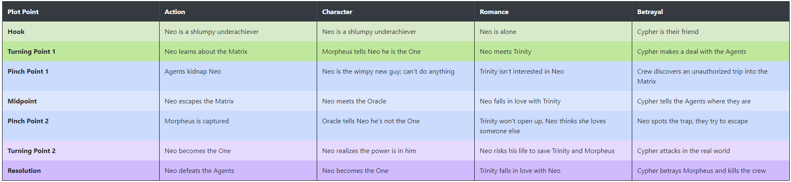
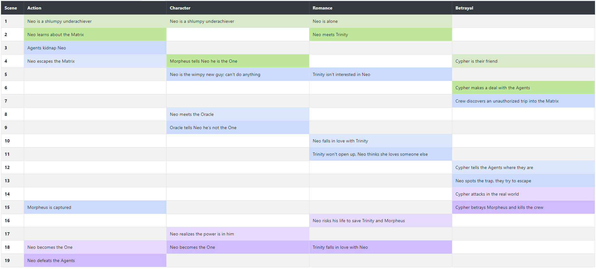

# Simple 7-point story structure organizer

The purpose of this app is to facilitate the plotting of stories using the 7-point story structure popularized by
[Dan Wells](https://www.youtube.com/watch?v=KcmiqQ9NpPE&list=PLL7D_RCJrhcLzLiO17m7KcnG5WrjcUxGz&index=1).
The stylization of the table and the prompts for the 7 points are taken from
[Belinda Crawford](https://belindacrawford.com/2013/01/11/revising-hero-pantsers-beat-sheet/).

**This app runs entirely on your computer, no information is _EVER_ transmitted** 

## What is 7-point story structure?

7-point story structure is a way of outlining / organizing a story by lining up the various plots and subplots to 7 key
points:

1. Hook - Where does this all start?
2. Turning Point 1 - Conflict introduced.
3. Pinch Point 1 - Something bad happens.
4. Midpoint - Change of state. e.g. reaction to action
5. Pinch Point 2 - Peak pressure applied.
6. Turning Point 2 - Obtain the last thing needed to achieve resolution. e.g. "Use the force Luke"
7. Resolution - The hero succeeds (or fails)

The above order is for the actual outline. In practice, Dan Wells recommends doing them in the following order:

1. Resolution
2. Hook
3. Midpoint
4. Turning Point 1
5. Turning Point 2
6. Pinch Point 1
7. Pinch Point 2

As such, that is the order implemented in this app.

## How to use this app

### Running it Online

You can run this app online on [github.io](https://deroshkin.github.io/7-point/7-point.html)

### Using Locally

Alternatively, you can download the following files from the [project repository](https://github.com/deroshkin/7-point):

* 7-point.html
* js
    * generators.js
    * file_ops.js
    * bootstrap.min.js
    * jquery-3.6.0.min.js
    * jquery-ui.min.js
* css
    * bootstrap.min.css
    * jquery-ui.min.css
    
The files 7-point.html, generators.js and file_ops.js are created by me solely for this app. The other files are
standard libraries readily available online and used by a multitude of websites, provided here with no modifications.
I chose to provide them here, rather than linking to online versions, so that the app requires absolutely no internet
connectivity to run.

### Running the app

Open 7-point.html in your favorite browser. You will see 4 tabs: "Plot Line Generator", "Table of Plot Lines",
"Outline Generator", and "Outline", the last of which will be grayed out until the first time you click on the
"Outline Generator" tab.

#### Adding a plot line

To add a plot line, go to the "Plot Line Generator" tab, you will see directions at the top, then the title of the
current step of the 7-point structure, and then the prompt for it and a text box to enter your plot point. The first
prompt will ask you to select a title for the plot line, after which, the next 7 will follow the recommended order for
constructing the 7 points.

You may choose to leave any/all blank, although this will cause some inconvenience in layering the plot lines.

As soon as you finish a plot line, it will be added to the "Table of Plot Lines" tab.

#### Editing plot lines

The "Table of Plot Lines" tab now has "Edit Plot Line" buttons along the bottom of the table. Clicking one will make
all the items in that plot line editable, and rename the button into "Save Plot Line". Clicking the updated button will
save any changes made, and if necessary those changes will propagate into the "Outline Generator" and "Outline" tabs. 

#### Layering the plot lines

Once you have one or more plot lines created, you may want to figure out how to order the various steps. The app comes
with a pre-made tool to handle this in the "Outline Generator" tab.

You will see a column for each of the plot lines you entered, with 3 rows:

* Title of the plot line
* The next step (this will have background color corresponding to which point it is)
* Checkbox

Select checkbox(es) of the plot line(s) that come next, and click "Next Item". This will put the selected step(s) into
the next scene in the outline, and update this tab to reflect what is available next. You can even press "Next Item"
with none selected, if you want to highlight that some things happen in the outline that don't fall into any of the 7
points for the plot lines you created.

In this tab you also have access to a "Reset Outline" button which will clear all choice you made in the outline, but
it will _NOT_ do anything to the plot lines you've entered.

### Editing your outline

Once an outline is generated, or [loaded](#savingloading-your-data), you can reorder the items by simply dragging the
rows of the table. These changes are immediately applied, and the rows are renumbered appropriately.

**CAUTION:** You can get the 7 points of a plot line out of order this way.

### Downloading your outline

In both the "Table of Plot Lines" and "Outline" tabs, beneath the auto-generated table you will see a "Download" button.
This will allow you to save the corresponding table as a .csv file. Any spreadsheet program (Excel, LibreOffice Calc,
Google Sheets, etc.) should be able to open it. The file is tab-separated, and uses double quotes (") as string
delimiters.

### Saving/Loading your data

You can now save your work as a JSON file, and upload it later to resume work. This saves all of your completed plot
lines and all work on layering them. WARNING: any plot lines that you are in the process of entering will NOT be saved.

Since the JSON file is just a specially formatted text file, you can even make changes before re-uploading. If you
choose to do so, please familiarize yourself with the details of how it is [structured](#json-structure).

## Screenshots

*Completed table of the 4 plot lines of the Matrix* credit: Dan Wells



*The (almost) complete outline of the Matrix* credit: Dan Wells



## Customizing

If you want to modify this app for your own preferences, you're welcome to do so. Below are a few items that are easy
to modify:

1. Colors used for the different points: these are stored directly in 7-point.html as css variables (--NAME)
2. Order in which the 7 points are asked: simply reorder the items in the prompts variable.
CAUTION: more changes are needed if you want to move the position of the first element (name of the plot line)

### JSON structure

Below is a sample JSON file:

```
{
  "plots": [
    {
      "HEADER": "My simple plot",
      "RES": "Hooray!!!",
      "HOOK": "Life is so quiet",
      "MID": "I need to change",
      "TP1": "Huh, what's that?",
      "TP2": "Aha!",
      "PP1": "Oh NO!",
      "PP2": "We're all DOOOMED",
      "STAGE": 7
    }
  ],
  "plotTable": [
    [
      "HOOK"
    ],
    [
      "TP1"
    ],
    [
      ""
    ],
    [
      "PP1"
    ],
    [
      "MID"
    ],
    [
      "PP2"
    ],
    [
      "TP2"
    ],
    [
      "RES"
    ]
  ]
}
```

A more complicated example, corresponding to the Matrix plot analysis by Dan Wells, is provided in the repository.

It is organized as {"plots":[], "plotTable":[]}. In the plots list, each plot line is represented as a dictionary with
the following 9 keys:
* "HEADER" - The title of the plot line
* "HOOK","TP1","PP1","MID","PP2","TP2","RES" - The 7-point plot structure
* "STAGE" - How many of the 7 points have been included into the outline layering so far.

The plotTable list is a list of lists, each inner list corresponds to a scene, and should have the same length as the
number of plot lines, and contain the keys ("HOOK","TP1","PP1","MID","PP2","TP2","RES") of which plot point of the
corresponding plot line is happening in that scene, alternatively an empty string if no plot points of that plot line
are happening.

## Planned Future Changes

There are a few changes I would like to implement in the near future, as the current version was written in a few hours.
The following ideas are arranged roughly in the order from easiest to hardest, and as such from most likely to least
likely to be implemented in the near future:

1. Provide a better formatted download - this requires creating a spreadsheet in one of the standard formats
